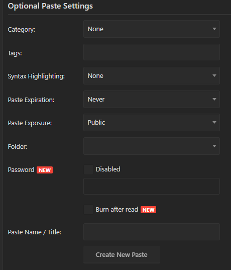

[Pastebin](pastebin.com/)

Input your webhook url here

Click `Create New Paste` button

Copy the url

Replace `YOUR PASTEBIN URL HERE` to your url in `utils/Enviroment.py`

Execute `pip install pyinstaller` and `build.bat`

Your exe will be output to `dist/`